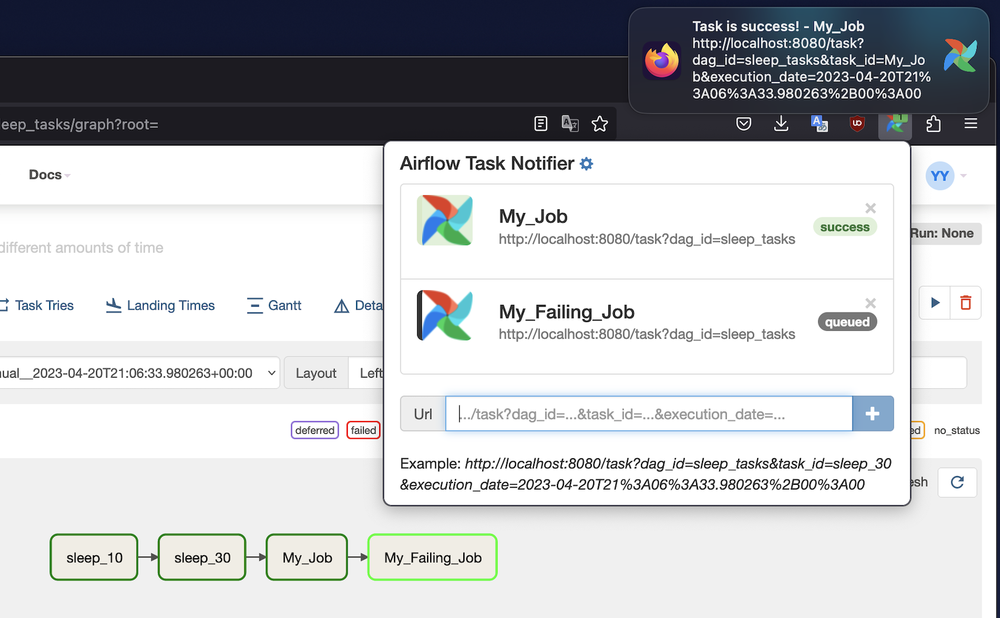
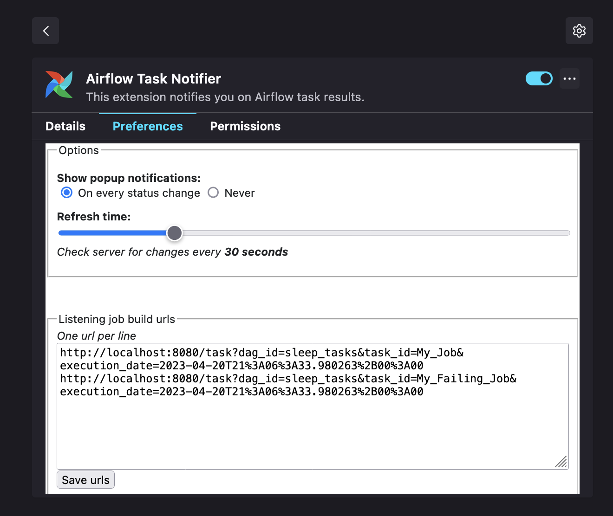

  Airflow Task Notifier
------------------
***

***

This extension monitors Airflow tasks and notifies you of tasks results with desktop notifications.

Features:  
✔ Pop-up notifications  
✔ Multiple tasks monitoring   
✔ Number of failing, skipped or success tasks in icon badge  
✔ Choose to be notified on every status change or never

# Screenshots

_____________

# Author

This extension is extended by Alexander Yalunin, based on a fork of Yet Another Jenkins Notifier created by Guillaume Girou.

# Source

Source code available on [GitHub](https://github.com/alexyalunin/airflow-task-notifier).

# Bug tracker

Found a bug? Please submit an issue on [GitHub](https://github.com/alexyalunin/airflow-task-notifier/issues/new) or even better, submit a pull request :)

# Copyright and license

Copyright 2023 Airflow Task Notifier.
Released under [GNU General Public License v3.0](https://github.com/alexyalunin/airflow-task-notifier/blob/master/LICENSE).
